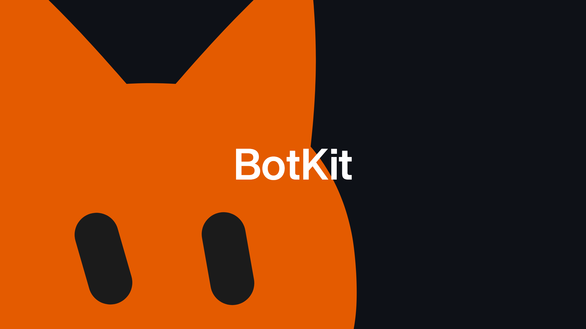
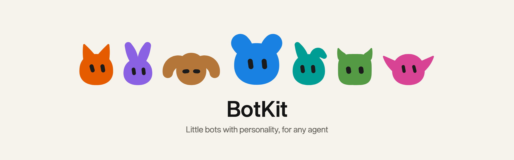

# BotKit

Little bots with personality, for any agent.

Give every agent a face. Each bot is a small character that blinks, breathes and glances around, listens while you talk to it, and fits in a short share code. Make yours at [forgedaughter.com/bots](https://forgedaughter.com/bots).

## API

Any name is a bot, the same one forever. Free, no key.

```
https://forgedaughter.com/bot/{name}.svg
https://forgedaughter.com/bot/{name}.png
```

<p>
  
  
  
  
  
</p>

| Option | |
| --- | --- |
| `.svg` `.png` | SVG for the web, PNG for email and chat apps. |
| `?size=` | 16 to 1024 pixels, default 256. Small bots draw bolder. |
| `?mood=` | idle, listening, happy, sleepy, content, smug, sad. |

Use an agent or user ID as the name, never an email: the name is part of the address. A bot you made in the creator has a share code (`b1.…`), and that works as a name too. Bots never change, so browsers and CDNs can cache them.

## Status

Early. The API is live and free; the bot engine and creator source move into this repo next.

## License

MIT

<picture>
  <source media="(prefers-color-scheme: dark)" srcset="assets/lineup-dark.png">
  
</picture>
